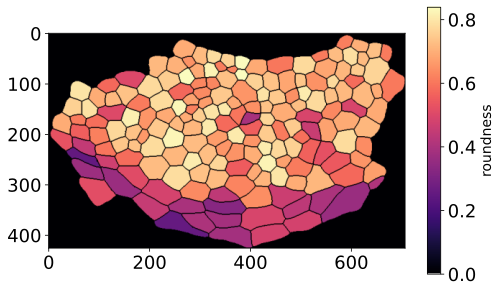

# parhyale_morpho
Codes and data related to parhyale morphogenesis project lead by Beatrice Steinert of the Extavour lab at Harvard University. </br>

<p align="center">
  
</p>

Codes related to analysis of the cell shapes and plots resulting from the analysis are contained in the Jupyter notebook ```BS_CK_Consolidated.ipynb``` </br>
The ```BS_CK_Consolidated.pdf``` is the PDF version of the notebook for those who want to just browse through the code. All the data files needed for the codes
to run are also contained in the main directory. So please download all the files and keep them in the same directory as ```BS_CK_Consolidated.ipynb``` for the 
codes to run.


<b>Cellular Potts Model simulation of the parhyale tissue growth </b> </br>

```parhyale_hpf26.zip``` is the zipped <b>Compucell3D</b> project folder. It contains all the relevant files needed to run the Compucell3D simulations. The project was 
created using Compucell3D Version="4.5.0". Compucell3D is freely available for download at https://compucell3d.org/


